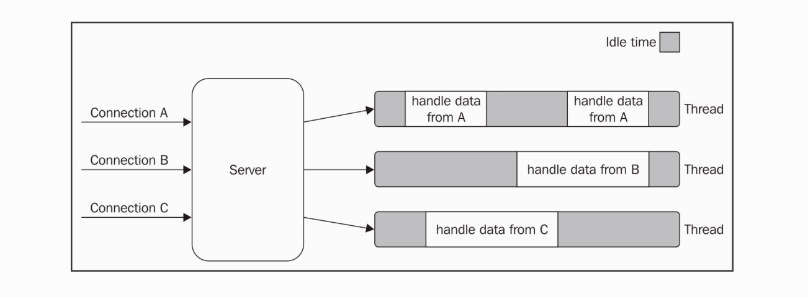
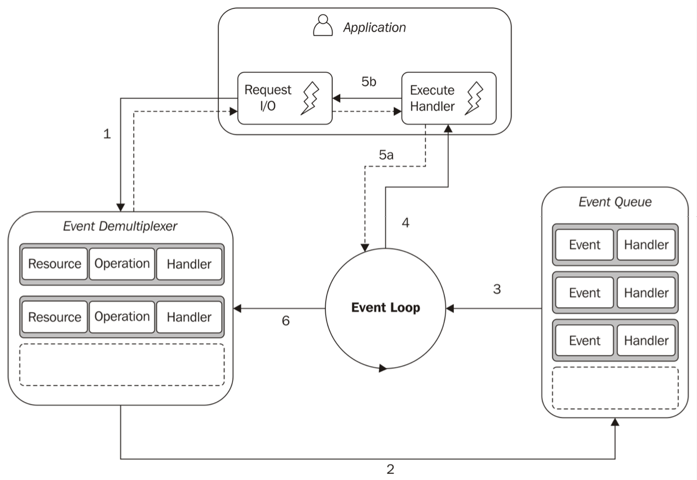
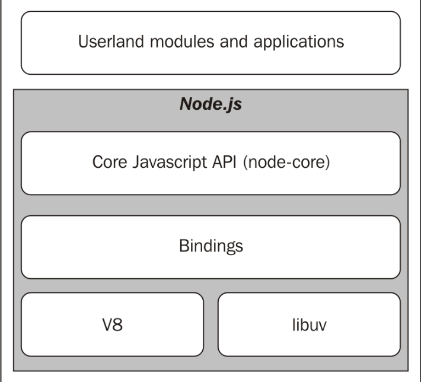

# Welcome to the Node.js Platform

在开发者在 Node.js 平台及其生态环境中的一些经验总结出一系列准则和设计模式中最奇怪的一项大概就是 Node.js 的天生异步以及它所带来的编程风格，最简单的体现就是其对回掉的严重运用。在我们首次探究这些准则及设计模式时这些东西非常重要。这不仅仅是为了写出正确的代码，而且还能让我们在处理更多更复杂的问题上采取有效的设计策略。

从另一方面来看这也描绘了 Node.js 自己的哲学理念。去脚踏实地地探究 Node.js 也会让我们去拥抱 Node.js 文化和社区。我们将见识到它是怎样对我们设计的方程式和组件以及对我们与社区间的交流产生巨大的影响。

为了最新版本的 Node.js 我们值得去学习了解一下 ES6 带来的新特性。去拥抱这些新语法和新功能对于写出清晰可读的代码来说非常重要，并且这种设计模式将贯穿本书。

在本章，我们将学习如下主题：

1. Node.js 哲学理念
1. 第六版 Node.js 和 ES2015
1. 响应模式 -- Node.js 的核心机制异步架构


## Node.js 哲学理念

每个平台都有由一系列被社区所接受的准则和指南构成的设计哲学，它们由一些影响着平台的意识形态演变而来，即方程式是如何被开发设计的。一些准则来自技术本身，一些来自生态平台，一些只是社区趋势，其他则由不同的意识形态的演变而来。在 Node.js 中，一些准则直接来自于它的创造者 Ryan Dahl；一些来自那些核心贡献者；一些来自社区领袖；一些准则则遗传自 JavaScript 文化或是 Unix 设计哲学。

这些规则不是强制执行的，它们需要看情况运用；而且在我们设计方程式的时候会提供给我们非常有用的灵感。

### 精简核心

Node.js 的核心本身构建在一些准则之上。最小化功能便是其一，即留出所谓的用户区来形成模块的生态环境。这些准则会对 Node.js 文化产生强大的影响，因为这给了社区在解决问题时试验和快速迭代的自由，而非在紧密的控制与稳定核心上被强制缓步演化。保持核心功能的精简不仅仅能为维护提供便利，而且在整个项目生态的演变上也会产生积极的文化效应。

### 精简模块

Node.js 使用了一种模块的概念来作为程序的基础结构。由构建方程式的块和重用的库构成了包（package）。在 Node.js 中，一个最基本的准则便是最小模块化原则，这不单以代码量来衡量，而且作用范围也是其最重要的衡量指标。

这项准则源于 Unix 设计哲学，具体对应下面两个准则：

* “Small is beautiful.”
* “Make each program do one thing well.”

Node.js 把这些概念带到一个全新的境界。在 npm 的帮助下，Node.js 通过分离每个包及其一系列的依赖来逃离依赖地狱。Node 的这种方式在实际上需要极度高的重用性，因此方程式由若干高度集成的小模块构成。尽管这些在其他平台完全被认为不切实际或者不可行，但在 Node.js 内我们却鼓励这种实践。所以少于 100 行代码的函数在 npm 内很常见。

除了可用性极高外，小模块也有如下好处：

* 易于理解使用
* 测试简单易维护
* 在浏览器内共享

更小更集中的模块让每个人都可以分享或重用即使是一小块代码；这把不重复自己的准则推向了新高度。

### 小表面积

为了精简起见，Node.js 模块通常只会暴露出最少的功能。这会提高 API 的可用性，换句话说这会使 API 更清晰。而且在大多数情况下模块的使用者也不需要扩展模块。

在 Node.js 中只暴露出一个入口功能然后把次级功能设定为属性的设计模式很常见。这将使功能更加清晰简单。

Node.js 中的模块大多用来直接使用而非扩展，这也许不够灵活但这简化了功能实现同时也加快了维护速度，提高了功能利用率。

### 简化与实用性

你听过 KISS 法则吗：
> “Simplicity is the ultimate sophistication.” – Leonardo da Vinci

简化设计拒绝大而全的软件是最佳实践中的一项设计准则。这将有利于快速实现功能，容易适配，易于理解维护，这也会推进社区的参与并使软件完善自身。

在 Node.js 中，这条法则同样适合 JavaScript。实际上简单的函数、闭包、对象字面量代替了类继承。纯面向对象设计中常常试图以高精度的计算来复制真实世界而忽略了真实世界内在的缺陷和复杂度。事实上我们可以实现这些理解内的复杂度而不是尝试去完全实现几乎完美的软件。

## Node.js 6 和 ES2015

本书将尽量使用新特性，下面将简单介绍 ES2015 的新特性。

### let 和 const 关键字

基于历史原因 JavaScript 只支持函数作用域和全局作用域来控制变量的生命期和可见性。就拿 if 语句来说吧，if 内的变量可以在全局内访问到：

````JavaScript
  if (false) {
      var x = "hello";
   }
   console.log(x);
   //undefined
````
在 ES2015 内引入了 let 关键字实现了块作用域：

````JavaScript
  if (false) {
      let x = "hello";
   }
   console.log(x);
   //ReferenceError: x is not defined
````

更有意义的例子就是用于循环了：

````JavaScript
  for (let i = 0; i < 10; i++) {
     // do something here
   }
   console.log(i);
   //ReferenceError: x is not defined
````

这样我们的代码会更安全，更易找到错误并避免副作用。

ES2015 引入了 const 关键字。这个关键字允许我们申明一个常量：

````JavaScript
const x = 'This will never change';
      x = '...';
// TypeError: Assignment to constant variable
````

常量不可改变。但要搞清楚 const 并不和其他语言内的常量的含义一致。实际上对于 const 来说，赋的值不是常量，绑定值才是常量：

````JavaScript
const x = {};
x.name = 'John';
````
即 x 是个对象这是不变的，但对象里的值可变

````JavaScript
x = null; // This will fail
````

const 在保护一些纯量值是很有用。

一项 const 的最佳实践就是引用模块的时候。

````JavaScript
const path = require('path');
// .. do stuff with the path module
let path = './some/path'; // this will fail
````

### 箭头函数

一项最棒的特性当属箭头函数。箭头函数更加简洁并在处理回掉时更好用：

````JavaScript
const numbers = [2, 6, 7, 8, 1];
const even = numbers.filter(function(x) {
   return x%2 === 0;
});

const numbers = [2, 6, 7, 8, 1];
const even = numbers.filter(x => x%2 === 0);

const numbers = [2, 6, 7, 8, 1];
const even = numbers.filter(x => {
 if (x%2 === 0) {
   console.log(x + ' is even!');
   return true;
} });
````

如果返回值多余一行，箭头函数只自动返回第一行而且还需要加上大括号，参数为空也需要在参数处加小括号。

箭头函数还有一点就是绑定了 this 为父级块的作用域：

````JavaScript
function DelayedGreeter(name) {
    this.name = name;
}
DelayedGreeter.prototype.greet = function() {
 setTimeout( function cb() {
   console.log('Hello ' + this.name);
  }, 500);
};

const greeter = new DelayedGreeter('World');
greeter.greet(); // will print "Hello undefined"


DelayedGreeter.prototype.greet = function() {
 setTimeout( (function cb() {
   console.log('Hello' + this.name);
 }).bind(this), 500);
};

DelayedGreeter.prototype.greet = function() {
 setTimeout( () => console.log('Hello' + this.name), 500);
};
````

这是因为 setTimeout 内的回掉作用域和 greet 的作用域不一致，以前我们必须使用 bind 重新绑定作用域，现在只需要使用箭头函数即可。

### 类语法

ES2015 引入了一种新的原型继承语法，这种语法并没有改变对象在 JavaScript 运行时的行为。属性的继承还是通过原型而非类来继承。这种语法糖用起来很顺手，可读性也高。所以我们来看看：

````JavaScript
function Person(name, surname, age) {
     this.name = name;
     this.surname = surname;
     this.age = age;
}
Person.prototype.getFullName = function() {
 return this.name + '' + this.surname;
};
Person.older = function(person1, person2) {
 return (person1.age >= person2.age) ? person1 : person2;
};


class Person {
   constructor (name, surname, age) {
     this.name = name;
     this.surname = surname;
     this.age = age;
}
   getFullName () {
     return this.name + ' ' + this.surname;
}
   static older (person1, person2) {
     return (person1.age >= person2.age) ? person1 : person2;
} }
````

constructor 作为类中构建函数声明的关键字，static 是静态方法的关键字。

类的引入带来了很棒的一项特性，我们以 extend 或 super 来扩展类：

````JavaScript
class PersonWithMiddlename extends Person {
   constructor (name, middlename, surname, age) {
     super(name, surname, age);
     this.middlename = middlename;
   }
   getFullName () {
     return this.name + '' + this.middlename + '' + this.surname;
   }
}
````

这和原型继承类似我们使用 extends 扩展 Person 类，用 super 来重新定义构建函数，最后重写 getFullName 方法。

### 增强对象字面量

与此同时 ES2015 引入了新的增强对象字面量的语法。这个语法提供了一种给对象成员赋值变量和函数的缩写语法，允许我们在对象创建的时候定义一个计算好的成员名，同时也提供了 setter 和 getter。

````JavaScript
const x = 22;
const y = 17;
const obj = { x, y };

module.exports = {
   square (x) {
     return x * x;
   },
   cube (x) {
     return x * x * x;
} };

const namespace = '-webkit-';
const style = {
 [namespace + 'box-sizing'] : 'border-box',
 [namespace + 'box-shadow'] : '10px10px5px #888888'
};
````

这种语法不需要 function 关键字。

````JavaScript
const person = {
 name : 'George',
 surname : 'Boole',
 get fullname () {
   return this.name + '' + this.surname;
},
 set fullname (fullname) {
   let parts = fullname.split('');
   this.name = parts[0];
   this.surname = parts[1];
} };
console.log(person.fullname); // "George Boole"
console.log(person.fullname = 'Alan Turing'); // "Alan Turing"
console.log(person.name); // "Alan"
````

值得注意的是，console.log(person.name); 会返回 "Alan" ，因为 get 得到的值都会从 set 里面取得。

### Map 和 Set 集合
ES2015 引入了 Map 原型，它被设计来实现更安全、更灵活、更直观的 hash 映射：

````JavaScript
const profiles = new Map();
profiles.set('twitter', '@adalovelace');
profiles.set('facebook', 'adalovelace');
profiles.set('googleplus', 'ada');
profiles.size; // 3
profiles.has('twitter'); // true
profiles.get('twitter'); // "@adalovelace"
profiles.has('youtube'); // false
profiles.delete('facebook');
profiles.has('facebook'); // false
profiles.get('facebook'); // undefined
for (const entry of profiles) {
 console.log(entry);
}
````
我们可以用 for...of 来遍历所有项目，这一项都是以键作为第一参数，值为第二参数的数组。

map 最有趣的是可以使用函数作为键。在以前的原生对象内你不能以函数作为键因为这里的函数将会被以字符串来处理：

````JavaScript
const tests = new Map();
 tests.set(() => 2+2, 4);
 tests.set(() => 2*2, 4);
 tests.set(() => 2/2, 1);
 for (const entry of tests) {
   console.log((entry[0]() === entry[1]) ? 'PASS' : 'FAIL');
}
````
值得注意的是当我们遍历 map 时，所有的键的顺序是按照被插入的顺序来定的，而这在对象里面是随机的。

与此同时，ES2015 引入了 Set 属性。这个属性允许我们简单地构建集合：

````JavaScript
const s = new Set([0, 1, 2, 3]);
s.add(3); // will not be added
s.size; // 4
s.delete(0);
s.has(0); // false
for (const entry of s) {
 console.log(entry);
}
````

如你所见 Set 和 Map 有点像，就是 set 方法变成了 add 方法。 在 Set 内还可以包含函数和对象。


### WeakMap 和 WeakSet 集合

ES2015 定义了 weak 版本的 Map 和 Set。

WeakMap 只允许对象作为键而且还不能遍历所有项目：

````JavaScript
let obj = {};
const map = new WeakMap();
map.set(obj, {key: "some_value"});
console.log(map.get(obj)); // {key: "some_value"}
obj = undefined; // now obj and the associated data in the map
// will be cleaned up in the next gc cycle

let obj1= {key: "val1"};
let obj2= {key: "val2"};
const set= new WeakSet([obj1, obj2]);
console.log(set.has(obj1)); // true
obj1= undefined; // now obj1 will be removed from the set
console.log(set.has(obj1)); // false
````

这样我们在键内保存元数据，当我们为 obj 赋值 undefined 后，元数据被移除。类似于 WeakMap， WeakSet 也是只能保存对象而且不能被遍历。


### 模版字符串
ES2015 提供了一种对字符串的语法支持即模版字符串  `${expression}` 。

````JavaScript
const name = "Leonardo";
const interests = ["arts", "architecture", "science", "music",
                  "mathematics"];
const birth = { year : 1452, place : 'Florence' };
const text = `${name} was an Italian polymath
interested in many topics such as
${interests.join(', ')}.He was born
in ${birth.year} in ${birth.place}.`;
console.log(text);
````

### 其他 ES2015 特性

另一个在第四版 Node.js 和 ES2015 中可使用且很有趣的特性是 Promise。我们将在第四章探讨细节。

其它在 ES2015 和 第六版 Node.js 中有趣的特性如下：

* 函数默认参数
* 剩余参数
* 展开操作符
* new.target
* Proxy
* Reflect
* Symbols

## 反应器模式
本节我们将介绍 Node.js 异步特性的核心 -- 反应器模式，并通过单线程架构、非阻塞 I/O 来理解整个 Node.js 平台。

### I/O 很慢
在内存上的操作很快，比硬盘操作快六个数量级。

### 阻塞型 I/O
传统的阻塞型 I/O 编程内，函数调用将一直阻塞进程直到操作结束。

使用阻塞型 I/O 的 web 服务将不能在同一进程内处理多重链接。    


### 非阻塞型 I/O

在这种操作模式下，系统调用将立即响应而不等待数据读写。如果在调用中没有响应，函数将简单返回预定义的常量。

大多数基本模式来处理这种非阻塞型 I/O 是通过轮询来判断的直到返回数据，这叫做忙时等待。

````JavaScript
resources = [socketA, socketB, pipeA];
 while(!resources.isEmpty()) {
   for(i = 0; i < resources.length; i++) {
     resource = resources[i];
     //try to read
     let data = resource.read();
     if(data === NO_DATA_AVAILABLE)
       //there is no data to read at the moment
       continue;
     if(data === RESOURCE_CLOSED)
       //the resource was closed, remove it from the list
       resources.remove(i);
     else
       //some data was received, process it
      consumeData(data);
    }
}
````
这种简单的技术已经可以在同一进程内处理不同的响应了，但是并不高效。轮询将会消耗大量的 CPU 资源。

### 事件多路分发
忙时等待不是处理非阻塞资源的理想技术。大多数现代系统都提供了一种原生的机制来处理一致性：同步事件分用器或称事件提醒接口。被监视的组件和 I/O 事件队列会被阻塞，直到可以运行新的事件：

````JavaScript
socketA, pipeB;
watchedList.add(socketA, FOR_READ);//[1]
watchedList.add(pipeB, FOR_READ);
while(events = demultiplexer.watch(watchedList)) { //[2]
//event loop
foreach(event in events) { //[3]
       //This read will never block and will always return data
       data = event.resource.read();
       if(data === RESOURCE_CLOSED)
         //the resource was closed, remove it from the watched list
         demultiplexer.unwatch(event.resource);
       else
         //some actual data was received, process it
         consumeData(data);
     }
}
````

1. 资源被添加到数据结构中，通过 read 操作关联。
1. 当资源被监视时设置事件提示，这个调用是同步且阻塞的，直到资源被读取。然后事件多路分发将返回调用和一系列可以处理的事件。
1. 每一个事件都通过事件多路分用处理后返回。这时事件相关联的资源便可保证被读取且不堵塞。处理事件的时候，流将被事件多路分用再次堵塞直到有新的事件可被处理，这就是事件轮询。

这样我们就可以在单线程下执行多个 I/O 操作了：


### 反应器模式

现在我们可以介绍反应器模式了。在理想情况下 Node.js 中的 I/O 操作将关联一个回掉函数，这个回掉函数在事件产生和轮询处理时调用：



1. 当发送新的请求给事件分发多用器时产生一个新的 I/O 操作。方程式将在操作完成后调用。给事件分发多用器提交新的请求是非阻塞的，方程式会迅速取得控制权。
1. 当一套操作完成后，事件分发多用器将把新的事件加到事件队列里面。
1. 这时事件轮询将遍历所有的事件队列。
1. 每个事件的处理函数都会调用。
1. 当事件处理完成时将会把权限交还给事件轮询（5a）。但是在处理程序执行时新的异步请求可能会在权限交还给事件轮询之前被插入到事件分发多用器里。
1. 当所有在事件队列里的事件被处理后，在事件分发多用器上的轮询将阻塞，轮询将在新事件出现的时候被触发。

现在异步行为很清楚了：方程式将在某一时刻访问资源并提供处理程序，而这个处理程序将在操作完成的另一个时刻被调用。

反应器模式将通过阻塞来处理 I/O 操作，直到被监视资源里出现新的事件，然后通过每个事件相关联的处理程序来产生回馈。

### Node.js-libuv 的非阻塞 I/O 引擎

每个操作系统都有其自己的事件分发多用器接口： epoll on Linux, kqueue on Mac OS X, and the I/O Completion Port (IOCP) API on Windows。除此之外，每一个 I/O 操作也依据资源的不同而变化，甚至是在相同的操作系统内。所以 Node.js 核心团队创建了一个叫 libuv 的 C 语言库，目的就是在所有平台及资源上统一行为；现在它相当于是 Node.js 的底层 I/O 引擎。

除了在系统处理层面上的抽象，libuv 也完成了反应器模式，因此也提供了创建事件轮询、处理事件队列、运行异步 I/O 操作及其它任务队列的 API。

### Node.js 窍门

反应器模式和 libuv 是 Node.js 的基础，但我们还需要下面三个组件来构建全平台：
* 一系列封装来暴露 libuv 和底层功能给 JavaScript。
* V8，Google 原先为 Chrome 开发的 JavaScript 引擎。这也是 Node.js 如此快而高效的原因。V8 也因其革命性的设计和高效的内存管理而备受称赞。
* 一个 JavaScript 核心库来实现 Node.js API 的高级抽象。



### 总结

在本章我们知道了 Node.js 平台上的一些重要基础的原则，平台背后的设计哲学及选择。事实上这将影响到我们每一个创建的方程式。通常来说来自其它平台的开发者需要转换一些观念才能熟悉这些。

另一方面，反应器模式天生的异步特性需要不同的编程风格。模块模式和这些级简准则在重用性、维护性、可用性上会产生奇效。

最后，除了在 JavaScript 快及高效之上，Node.js 也因这些准则变得更加有趣。

在下一章我们将探究 Node.js 的异步模式：回掉模式和事件分发。我们将理解同步和异步的区别并写出清晰的功能。
