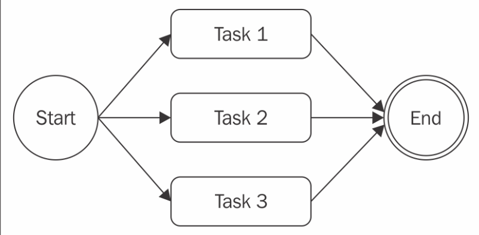
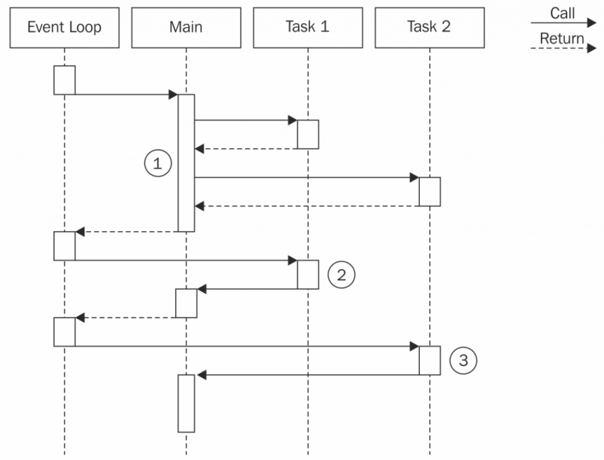

# Asynchronous Control Flow Patterns with Callbacks

从同步编程转换到一个充满连续传入风格和异步接口的平台来一定会充满困惑。 写回掉代码一定会是一种不同的体验特别是在控制流中。 异步代码可能难以预言哪个语句会被程序执行。 所以像是遍历文件、 执行队列任务或是等待一系列操作等操作需要开发者来采取一种新的方式来实现从而避免写出低效不可读的代码。 一个常见的错误就是陷入回掉地狱眼睁睁看着代码在水平方向无限延伸， 嵌套过深导致一个简单的流程变得复杂。

在本章， 我们将看看如何来通过一些法则和模式写出清晰可控的异步代码从而驯服回掉。 我们将看到如何操控流程库， 就像 async 可以明显简化问题来使我们的代码可读性可维护性更高。

## 异步编程的难点

让异步代码变得难以控制很简单。 闭包和原地定义的异步函数可以让我们不必关注其他点。 这完美符合 KISS 原则； 简单并使代码流可控。 不幸的是， 这样以牺牲模块性、 重用性和可维护性将在不久导致对回掉嵌套的失控和激增的函数数量最终失去组织力。 大多数情况下， 创建闭包不是因为功能需要， 所以它带来更多附加的惩罚。 记住我们的代码开始变得笨重， 而能否提前知道这些就是新手和专家的区别了。

## 创建一个简单的网络爬虫

为了解释这个问题， 我们将创建一个小爬虫， 一个由 web 地址取的内容并下载在本地文件命令行方程式：

* request： 一个 HTTP 请求库
* mkdir： 一个递归创建目录的工具

当然我们将时常提起一个本地模块 ./utilities， 它包含一些辅助函数。

我们方程式的核心功能包含在 spider.js 模块内：

````JavaScript
const request = require('request');
const fs = require('fs');
const mkdirp = require('mkdirp');
const path = require('path');
const utilities = require('./utilities');

function spider(url, callback) {
  const filename = utilities.urlToFilename(url);
  fs.exists(filename, exists => {                   //[1]
    if (!exists) {
      console.log(`Downloading ${url}`);
      request(url, (err, response, body) => {       //[2]
        if (err) {
          callback(err);
        } else {
          mkdirp(path.dirname(filename), err => {   //[3]
            if (err) {
              callback(err);
            } else {
              fs.writeFile(filename, body, err => { //[4]
                if (err) {
                  callback(err);
                } else {
                  callback(null, filename, true);
                }
              });
            }
          });
        }
      });
    } else {
      callback(null, filename, false);
    }
  });
}
````

1. 通过当前文件是否已经被创建来检查 URL 是否已经被下载
1. 未创建则继续下载
1. 确定目录下是不是包含已存在的文件
1. 最后把文件写入

为了启动我们的方程式我们在命令行内调用 spider() 函数：

````JavaScript
spider(process.argv[2], (err, filename, downloaded) => {
  if(err) {
       console.log(err);
     } else if(downloaded){
       console.log(`Completed the download of "${filename}"`);
     } else {
       console.log(`"${filename}" was already downloaded`);
     }
});
````

然后我们开始下载文件：``node spider http://www.example.com``

> 此处需要的其它代码如 utilities.js 需从此书官方网站下载

## 回掉地狱

在我们先前定义的 spider() 函数内， 我们实现的算法很直接而且有多层缩进导致可读性很差。

大量的闭包和就地的回掉定义使得代码可读性变差而且难以维护这被称为回掉地狱。 这通常被认为是反模式化的。 典型结构如下：

````JavaScript
asyncFoo( err => {
     asyncBar( err => {
       asyncFooBar( err => {
         //...
       });
  });
});
````

我们可以看到这种结构就像金字塔一样， 也被叫作毁灭金字塔。

最明显的问题就是多层次的嵌套导致可读性变差。 另一个问题是在每个作用域内变量名字的重叠。 回掉内有 err、 err1、 err2、 err3 参数；或者都使用相同的 err 参数。 两种方案都不理想。

## 使用原生 JavaScript

既然我们意识到遇到了回掉地狱， 我们就应该避免它； 但是， 这不是唯一需要担心的点。 实际上， 有很多情形都需要使用特别的技术和模式特别是在我们仅仅使用原生 JavaScript 来解决问题时。 例如在用异步处理一系列集合时， 这不像使用 forEach 遍历数组那么简单， 它需要使用一种类似递归的技术。

在本节， 我们不仅要学习避免回掉地狱而且要去用原生 JavaScript 去实现一些常见的控制流模式。

### 回掉法则

写异步代码时的第一个准则就是不要乱用闭包。 很简单， 但修复回掉地狱一般只需要少用回掉即可。

这里有一些基本准则：

* 你必须在可能时退出。 使用 return, continue, 或者 break， 依赖于上下本， 迅速退出当前的语句而非写下 if...else 语句。 这将是我们的代码变得浅一些。
* 你需要为回掉创建一个命名函数， 写在回掉函数外面并传入过渡结果作为参数。
* 你需要模块化代码。 把代码分割为更小， 重用性更高的函数， 尽可能。

### 运用回掉法则

我们现在就来试试这些法则并运用在前面的代码上：

````JavaScript
if(err) {
   callback(err);
} else {
   //code to execute when there are no errors
}

if(err) {
 return callback(err);
}
//code to execute when there are no errors
````
第一步， 我们要移除错误检查模式。 这将立即返回错误在我们接收到错误后。

用这个简单的技巧， 我们缩减了函数的嵌套深度； 非常简单。

> 一个常见错误就是发现错误后不返回
````JavaScript
if(err) {
  callback(err);
} //code to execute when there are no errors.
````
永远别忘记了在回掉执行完成后执行函数将继续执行。 插入一个 return 来阻塞后面的执行非常重要。 具体返回什么其实不重要。 我们还可以这样写：
````JavaScript
callback(...)
return;
````

现在我们来继续修改我们的 spider() 函数， 我们试着找出可重用的代码。 例如， 写一个把字符串传递给文件的函数：

````JavaScript
function saveFile(filename, contents, callback) {
   mkdirp(path.dirname(filename), err => {
     if(err) {
       return callback(err);
     }
     fs.writeFile(filename, contents, callback);
   });
}
````

同样的， 我们可以一个通用函数来下载：

````JavaScript
function download(url, filename, callback) {
   console.log(`Downloading ${url}`);
   request(url, (err, response, body) => {
     if(err) {
       return callback(err);
     }
     saveFile(filename, body, err => {
         if(err) {
           return callback(err);
         }
         console.log(`Downloaded and saved: ${url}`);
         callback(null, body);
     );
   });
}
````

最后我们修改好的 spider() 函数：

````JavaScript
function spider(url, callback) {
     const filename = utilities.urlToFilename(url);
     fs.exists(filename, exists => {
       if(exists) {
         return callback(null, filename, false);
       }
       download(url, filename, err => {
         if(err) {
           return callback(err);
         }
         callback(null, filename, true);
       })
    });
}
````

功能接口不变我们只是变化了代码组织。 通过运用基本原则， 我们大幅度削减了嵌套层级同时增加可读性和可测试性。 实际上， 我们可以暴露出 saveFile() 和 download() 函数， 然后在其它模块内重用同时也更易于测试。

### 序列执行

现在我们开始探索异步控制流模式。 我们以分析序列执行模式开始。

在序列内执行一系列任务意味着运行它们在某一段时间内， 一个完了又一个。 执行顺序很重要而且还必须稳定， 因为队列里任务的结果可能影响下一个执行：


这里有些不同此流程的点：

* 在序列内启动一系列已知的任务， 不用链接或传递结果
* 使用任务的输出作为下一个的输入
* 当在每个元素上运行一个异步任务时遍历集合， 一个接一个

序列执行， 尽管在使用直接风格阻塞 API 实现， 但依然是在使用异步 CPS 时经常造成回掉地狱主要原因。

### 在序列内启动一系列已知任务

我们在实现 spider() 函数时已经实现了序列启动。 通过运用简单的法则， 我们已经能在序列执行流内组织一系列已知任务。 按指南后我们这样写：

````JavaScript
function task1(callback) {
   asyncOperation(() => {
     task2(callback);
   });
}
function task2(callback) {
   asyncOperation(result () => {
     task3(callback);
   });
}

function task3(callback) {
   asyncOperation(() => {
     callback(); //finally executes the callback
   });
}

task1(() => {
   //executed when task1, task2 and task3 are completed
   console.log('tasks 1, 2 and 3 executed');
});
````

处理模式展现了每个任务是如何调用下一个通过异步操作的。 模式把重点放在了任务的模块性上， 展现了在处理异步代码时不是必须使用闭包的。


### 序列遍历

在事先知道有多少任务将运行后， 我们先前描述的模式很完美。 这允许我们在序列内硬编码任务调用； 但是如果我们想要在每个项目内执行异步操作呢？ 这样我们就不能硬编码了， 我们必须动态构建。

#### 网络爬虫 2

为了演示序列遍历， 我们再次实现网络爬虫并加一个新功能。 我们现在递归下载一个页面内所有的链接。 为此， 我们需要取出页内所有的链接并为每个链接指定爬虫程序。

第一步就是使用新函数 spiderLinks() 去递归地下载所有的链接。

当然， 不是先检查文件是否存在， 我们现在试着去读取它， 然后爬取它的链接； 这样， 我们将可能先打断下载。 最后就是传递一个新的参数 nesting 帮助我们限制递归的深度：

````JavaScript
function spider(url, nesting, callback) {
  const filename = utilities.urlToFilename(url);

  fs.readFile(filename, 'utf8', (err, body) => {
         if(err) {
           if(err.code ! == 'ENOENT') {
             return callback(err);
           }
           return download(url, filename, (err, body) => {
             if(err) {
               return callback(err);
             }
             spiderLinks(url, body, nesting, callback);
            });
          }
         spiderLinks(url, body, nesting, callback);
  });
}
````

#### 序列爬取链接

现在我们来创建新版本爬虫的核心， spiderLinks() 函数使用一个序列化异步遍历算法来下载所有 HTML 页面。

````JavaScript
function spiderLinks(currentUrl, body, nesting, callback) {
  if(nesting === 0) {
    return process.nextTick(callback);
  }
  const links = utilities.getPageLinks(currentUrl, body);  //[1]
  function iterate(index) {                         //[2]
    if(index === links.length) {
      return callback();
    }
    spider(links[index], nesting - 1, err => {      //[3]
      if(err) {
        return callback(err);
      }

      iterate(index + 1);
    });
  }
  iterate(0);                                         //[4]
}
````

1. utilities.getPageLinks() 函数来获取全部页内链接。 这个函数只返回内部地址的链接（同一种主机名下）
1. 我们用 iterate() 函数遍历所有链接， 并取得下一个链接进去分析。 在本函数内， 我们首先要检查的就是索引值是否等于链接数组的长度， 是的话便调用回掉退出
1. 处理链接。 调用 spider() 函数并降低嵌套层次然后再在操作完成后调用下一次遍历
1. 我们以 iterate(0) 启动遍历

上面的算法允许我们通过在序列内的一个异步操作遍历一个数组。

我们现在的新版本爬虫可以递归下载网站上的所以链接。 如果链接太多我们可以使用 ``Ctrl + C`` 来退出程序。 我们也可以再次输入相同的 URL 来退出程序。

#### 模式

spiderLinks() 函数展示了如果使用异步操作来遍历一个数组。 这种模式也可以用到其它遍历序列的情形中：

````JavaScript
function iterate(index) {
 if(index === tasks.length)  {
   return finish();
 }
 const task = tasks[index];
 task(function() {
   iterate(index + 1);
 });
}
function finish() {
 //iteration completed
}
iterate(0);
````

如果  task() 是异步操作那么这种算法就是真正的递归了。 这样， 栈将被塞满而且可能出现溢出的情况。

我们前面演示的模式很厉害， 它还适用一些其它的状况； 例如， 我们可以对数组作 map 操作或这把结果传入下一个遍历内从而实现 reduce 算法。

### 平行启动

这里还有一种情况即启动的顺序不重要我们只是需要一些任务全部执行完毕再操作。



这听起来有些奇怪如果我们知道 Node.js 是单线程的， 但就如我们在第一章探讨的虽然是单线程的但我们依旧可以达到一致性， 这得益于 Node.js 天生的非阻塞性。 实际上， 平行这个词用在此处很合适，因为平行不意味着同步运行， 它们是在非阻塞 API 和事件轮询之下执行的。

正如我们所知， 当任务请求一个新的异步操作时任务的控制权会交还给事件轮询然后事件轮询启动另一个任务。 一个适当形容这种流程的词就是并发性， 当时我们为了简单还是用平行吧。

下图显示两个异步任务可以在 Node.js 中平行：



1. Main 函数启动 Task 1 和 Task 2 因为触发器是异步的所以它们迅速把控制权给还给 Main 函数， 然后再返回给事件轮询
1. 当 Task 1 的异步操作完成后， 事件轮询把控制权返给 Main 函数
1. 当 Task 2 触发异步操作时， 事件轮询调用它本身的回掉。 当 Task 2 完成后 Main 函数也会收到通知， 所以 Main 会知道 Task 1 和 Task 2 都完成了， 所以就可以继续执行操作了

简单来说， 我们可以在 Node.js 中启动一个平行异步操作， 因为它们同时被内部的非阻塞 APIs 所控制。 在 Node.js 中同步即阻塞的操作不能同时运行除非这些操作被放入到异步操作中或是通过 setTimeout() 或 setImmediate() 所延时。

### 网络爬虫 3

在版本 2 的爬虫里我们使用递归下载了所有链接， 现在我们可以使用平行下载所有链接从而提高性能。

我们来修改 spiderLinks() 函数来让 spider() 任务一次下载完， 并让它在所有任务完成后再启动一个回掉：

````JavaScript
function spiderLinks(currentUrl, body, nesting, callback) {
  if (nesting === 0) {
    return process.nextTick(callback);
  }
  const links = utilities.getPageLinks(currentUrl, body);
  if (links.length === 0) {
    return process.nextTick(callback);
  }
  let completed = 0,
    hasErrors = false;

  function done(err) {
    if (err) {
      hasErrors = true;
      return callback(err);
    }
    if (++completed === links.length && !hasErrors) {
      return callback();
    }
  }
  links.forEach(link => {
    spider(link, nesting - 1, done);
  });
}
````

我们来看看发生了什么。 spider() 任务一齐执行。 只通过简单地遍历链接数组就行了， 也不需要等待先前的任务：

````JavaScript
links.forEach(link => {
  spider(link, nesting - 1, done);
});
````

然后就是让所有任务完成后提供一个特别的回掉即 done() 函数。 done() 函数会在 spider() 函数完成时增加计数。 当所有下载等于链接数量时， 最终的回掉被执行：

````JavaScript
function done(err) {
  if(err) {
   hasErrors = true;
   return callback(err);
  }
  if(++completed === links.length && !hasErrors) {
   callback();
  }
}
````

就这么简单， 我们不再需要递归来下载页面了因为我们不再需要等待前一个任务完成后再进行下一个了从而提升了性能。

### 模式

通过前面的执行流， 我们可以看到一个很棒的模式：

````JavaScript
const tasks = [ /* ... */ ];
let completed = 0;
tasks.forEach(task => {
 task(() => {
   if (++completed === tasks.length) {
     finish();
   }
 });
});

function finish() {
 //all the tasks completed
}
````

一个简单的修改我们就可以使用模式来累加每个任务的结果， 来过滤或 map 数组中的每个元素或是在任务完成后调用 finish() 回掉（competitive race）。

### 用同时任务修复竞争条件

在多核心内使用阻塞 I/O 时运行一系列平行任务会有问题。 但是， 对于 Node.js 就是另一回事了； Node.js 平行地运行多个异步操作任务很直接也很方便。 这是 Node.js 最强大的优势。

Node.js 并发性模型的另一个典型之处就是我们在处理同步任务和竞争条件的方式。 在多线程编程内， 通常使用一些如锁、 互斥器、 信号、 监视器等构想， 它们可能是平行化内最复杂的一部分， 同时也对性能产生相当大的影响。 在 Node.js 中， 我们通常不需要花俏的同步机制， 因为所有东西都是单线程运行的！ 但是， 这不意味着我们不会有竞争条件； 相反的， 竞争条件十分普遍。 问题的根源是异步操作的调用和其结果的通知间的延迟。 其实这个问题在我们最后版本的爬虫内就有。

````JavaScript
function spider(url, nesting, callback) {
  const filename = utilities.urlToFilename(url);
  fs.readFile(filename, 'utf8', (err, body) => {
        if (err) {
          if (err.code !== 'ENOENT') {
            return callback(err);
          }
          return download(url, filename, function(err, body) {
                //...
````

问题就是两个 spider 任务在操作同一个 URL 时可能从一开始就在同一个文件上调用 fs.readFile()，  而后两个任务间有一个完成下载和创建文件， 造成两个任务开始一个下载。 解决方案如下：


处理图表展现了 Task 1 和 Task 2 被插入到一个 Node.js 进程， 然后一个异步操作引出一个竞争条件。 在事例中， 两个 spider 任务因为下载同一个文件而结束。

我们该如何解决呢？ 答案比我们想的更简单。 实际上， 我们只需要在运行同一个 URL 上的一个不包含多个 spider 任务的变量：

````JavaScript
const spidering = new Map();

function spider(url, nesting, callback) {
  if (spidering.has(url)) {
    return process.nextTick(callback);
  }
  spidering.set(url, true);
  //...
````

修复不需要多说。 如果给定的 url 已经存在 spidering 映射内我们就简单地退出函数； 另外， 我们还设置继续下载的标志。 对于这个例子， 我们不需要释放锁， 因为我们不关注下载一个 URL 两次， 即使是当 spider 任务在同一个点被启动两次。

竞争条件可以引发很多问题， 即使是在单进程环境中。 在很多情况下， 它们会导致数据出错而且难以调试因为这问题非常短暂。 所以运行平行任务时多次检查是最佳实践。

## 被限制的平行启动

产生一个失控的平行任务可以导致高额的载入。 想象一下有数千个文件、 URL 需要读取， 数千个数据库查询同时平行运转。 一个普遍的问题是用尽了资源， 例如， 在方程式打开时这些全部会一次性发生。 在一个 web 方程式中， 这可能会产生一个 DoS 攻击。 在这种情况下， 在同一时刻限制平行任务的数量是个好主意。 如此一来， 我们就可以预测载入量并保证服务不会耗尽资源。 下面的图表就描述了一种五个任务分为两个平行运行的情况：


1. 起初我们产生了最大限制数的任务
1. 然后每当任务完成， 我们再产生出更多的任务直到我们没有达到最大限制

### 限制并发

我们在线来限制并发：

````JavaScript
const tasks = ...
  let concurrency = 2,
      running = 0,
      completed = 0,
      index = 0;

function next() {                           //[1]
  while (running < concurrency && index < tasks.length) {
    task = tasks[index++];
    task(() => {                            //[2]
      if (completed === tasks.length) {
        return finish();
      }
      completed++, running--;
      next();
    });
    running++;
  }
}
next();

function finish() {
  //all tasks finished
}
````

这个算法可以算是序列启动和平行启动的混合。 实际上， 我们可能注意到两种模式的相似点：

1. 在 next() 是个遍历函数， 然后一个内遍历产生了尽可能多的平行任务
1. 我们在每个任务传入的回掉会检查我们是否完成了列表内的所有函数。 如果还有任务需要运行， 它将调用 next() 函数来产生另外一群任务。

### 在全局限制并发

我们的爬虫是运用我们学到的并发知识的绝佳案例。 实际上， 为了避免出现同一时间成千上万的爬虫情况， 我们可以通过添加一些规则来强制限制这个程序的并发数量。

我们可以在我们 spiderLinks() 函数上运用这种模式， 但我们只能限制单张页面上的链接数量。 我们可以设置并发为 2 ， 这样每个页面只能同时下载两个链接， 然后两个链接后再各下载两个最后呈几何数级增长。

#### 救援队列

我们其实是想限制全局的下载数量。 我们现在通过队列来限制多重任务的并发。

我们使用 TaskQueue 来实现：

````JavaScript
class TaskQueue {
  constructor(concurrency) {
    this.concurrency = concurrency;
    this.running = 0;
    this.queue = [];
  }
  pushTask(task) {
    this.queue.push(task);
    this.next();
  }
  next() {
    while (this.running < this.concurrency && this.queue.length) {
      const task = this.queue.shift();
      task(() => {
        this.running--;
        this.next();
      });
      this.running++;
    }
  }
};
````

这个构造函数以并发量为参数， 然后初始化 running 和 queue 变量。 以前的变量用来跟踪运行中的任务， 因为后面的数组用作存储未完成任务的队列。

pushTask() 方法简单地为队列添加任务并启动后面的任务。

next() 方法产生一系列队列任务， 并保证不会超出并发限制。

我们可能注意到这个方法和前面的很相似。 它本质上以不超过并发限制的尽可能多的队列任务开始。 当每个任务结束时， 它会更新运行任务的数量并通过 next() 来开始下一轮任务。 TaskQueue 类最有意思的地方在于它允许我们动态向队列添加项。

#### 爬虫 4

既然我们有了新的队列来限制平行流中任务的数量， 我们就在爬虫里试试吧：

````JavaScript
const TaskQueue = require('./taskQueue');
const downloadQueue = new TaskQueue(2);


function spiderLinks(currentUrl, body, nesting, callback) {
  if (nesting === 0) {
    return process.nextTick(callback);
  }
  const links = utilities.getPageLinks(currentUrl, body);
  if (links.length === 0) {
    return process.nextTick(callback);
  }
  let completed = 0,
    hasErrors = false;
  links.forEach(link => {
    downloadQueue.pushTask(done => {
      spider(link, nesting - 1, err => {
        if (err) {
          hasErrors = true;
          return callback(err);
        }
        if (++completed === links.length && !hasErrors) {
          callback();
        }
        done();
      });
    });
  });
}
````

新方案很简单：

* 通过自定义回掉启动 spider()
* 在回掉内检查 spiderLinks() 函数相关的任务是否完成。 如果完成， 调用 spiderLinks() 中最后的回掉
* 最后， 调用 done() 回掉让队列继续执行

## 异步库

我们以前分析过的控制流模式都可以构建成可重用和更通用的解决方案。 例如， 我们可以包装未限制并发数的算法为一个接收一系列任务的函数， 而这种函数早在 async (https://npmjs.org/package/async) 所做的。 async 库是一个非常流行的解决异步代码的方案。 它提供了一系列函数来简单地操作一系列任务。

### 序列执行

async 库可以帮助我们实现复杂的异步控制流， 但选择合适的辅助方法是个难点。 例如， 对于序列执行流， 这里有 20 多各不同的函数供你选择： eachSeries(), mapSeries(), filterSeries(), rejectSeries(), reduce(), reduceRight(), detectSeries(), concatSeries(), series(), whilst(), doWhilst(), until(), doUntil(), forever(), waterfall(), compose(), seq(), applyEachSeries(), iterator(), timesSeries()。

选择正确的函数是写出简洁可读的代码非常重要的一步， 但这需要经验和实践。

现在我们看看 async 是怎么工作的， 在我们的爬虫内试一下。

先安装 ``npm install async`` 再引入 ``const async = require('async');``

#### 序列执行已知任务

我们的 download() 函数执行下面的序列：

1. 下载一个 URL 的内容
1. 创建新的目录
1. 保存 URL 的内容到文件

async.series() 就是理想的函数， ``async.series(tasks, [callback])``

它接收一系列任务和一个回掉作为参数。

async 也使用相同的回掉法则并自动处理错误。 所以有任意任务调用错误回掉， async 将跳过剩下的任务并直接到达最后的回掉：

````JavaScript
function download(url, filename, callback) {
  console.log(`Downloading ${url}`);
  let body;
  async.series([
    callback => {                                 //[1]
      request(url, (err, response, resBody) => {
        if (err) {
          return callback(err);
        }
        body = resBody;
        callback();
      });
    },
    mkdirp.bind(null, path.dirname(filename)),    //[2]
    callback => {                                 //[3]
      fs.writeFile(filename, body, callback);
    }
  ], err => {                                     //[4]
    if (err) {
      return callback(err);
    }
    console.log(`Downloaded and saved: ${url}`);
    callback(null, body);
  });
}
````

1. 第一个任务调用 URL  下载。 并返回 response
1. 第二个任务是创建下载页的目录。
1. 最后写入内容
1. 所有任务完成后， 进行错误处理

#### 序列遍历

我们用 async.eachSeries() 来遍历序列：

````JavaScript
function spiderLinks(currentUrl, body, nesting, callback) {
  if (nesting === 0) {
    return process.nextTick(callback);
  }
  const links = utilities.getPageLinks(currentUrl, body);
  if (links.length === 0) {
    return process.nextTick(callback);
  }
  async.eachSeries(links, (link, callback) => {
    spider(link, nesting - 1, callback);
  }, callback);
}
````

#### 平行执行

重写 spiderLinks() 函数：

````JavaScript
function spiderLinks(currentUrl, body, nesting, callback) {
  // ...
  async.each(links, (link, callback) => {
    spider(link, nesting - 1, callback);
  }, callback);
}
````

#### 限制平行执行

````JavaScript
const downloadQueue = async.queue((taskData, callback) => {
     spider(taskData.link, taskData.nesting - 1, callback);
}, 2);

function spiderLinks(currentUrl, body, nesting, callback) {
  if (nesting === 0) {
    return process.nextTick(callback);
  }
  const links = utilities.getPageLinks(currentUrl, body);
  if (links.length === 0) {
    return process.nextTick(callback);
  }
  const completed = 0,
    hasErrors = false;
  links.forEach(function(link) {
    const taskData = {
      link: link,
      nesting: nesting
    };
    downloadQueue.push(taskData, err => {
      if (err) {
        hasErrors = true;
        return callback(err);
      }
      if (++completed === links.length && !hasErrors) {
        callback();
      }
    });
  });
}
````

## 总结

在本章我们深入学习了 Node.js 的异步控制流并借助 async 来简化普通流程。

下一章将介绍更多的高级技术例如承诺和生成器， 当你掌握了这些你就可以选择最佳的解决方案了。
