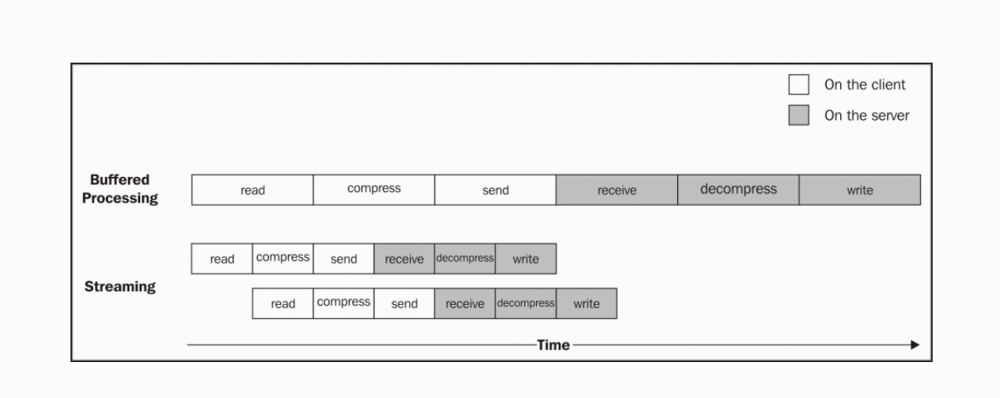
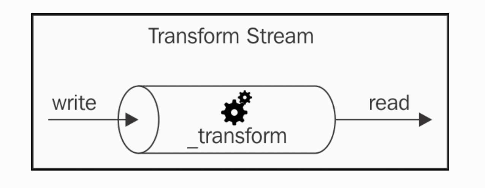

# Coding with Streams

流是 Node.js 中最重要的组件和模式。在社区中有一句格言： “流是一切！”，这就是流。有很多原因让流充满吸引力；这不仅是关于技术上的性能和效率，这更多的关乎到对 Node.js 哲学的优雅适配。

在本章，你将学到下面的主题：

* 为什么流在 Node.js 中如此重要
* 创建并使用流
* 流作为编程范例：不只在 I/O 中大放异彩
* 管道模式和连接流在不同的配置

## 走进流

在 Node.js 这类基于事件的平台中，流是最完美实时处理 I/O 操作的选择。

### buffering 对流

在本书内我们提到的额大部分异步 API 都使用了 buffer 模式。对于一个输入操作，buffer 模式中所有的数据都被转换为 buffer；当整个资源被读取时 buffer 被传入回掉。下面的图展示了这个过程：


在 t1 内，一些数据被资源所接收然后存入了 buffer。在 t2 内，另一些数据块被接收，直到读操作完成后所有的 buffer 被发送给了消费者。

从另一方面说，流允许我们在数据到达资源时立即对其进行操作。


每当有新的数据块被资源接收时，它就会立即提供给消费者，消费者也可以直接对其进行操作。

但是这两种实现有什么区别呢？主要有两个方面：

* 空间效率
* 时间效率

但是，Node.js 流有另一个最重要的优势：组合性。 我们来看看这到底是什么意思。

### 空间效率

首先，流允许我们做那些不可能的事情，一次处理 buffer 数据。例如当我们在读取一个特别大的文件时，成百上千兆的文件。当文件被完全被读取后返回一个 buffer 可不是个好主意，可以想象一下那些同时读取几个大文件的情况。我们的应用可以轻易被耗尽内存。而且在 V8 内 buffer 的大小被限制到 1GB 以内。

#### 使用 buffer API 来进行压缩

一个具体的例子，我们用命令行来压缩文件。使用 buffer API 来对文件进行 gzip：

````JavaScript
const fs = require('fs');
const zlib = require('zlib');

const file = process.argv[2];

fs.readFile(file, (err, buffer) => {
  zlib.gzip(buffer, (err, buffer) => {
    fs.writeFile(file + '.gz', buffer, err => {
      console.log('File successfully compressed');
    });
  });
});

````
现在我们可以这样来压缩文件

**node gzip <path to file>**

如果我们选择了一个大于 1GB 的文件，我们将接收到像下面这样的错误提示：

**RangeError: File size is greater than possible Buffer: 0x3FFFFFFF bytes**

这时就该让流出场了。

#### 使用流来进行压缩

````JavaScript
const fs = require('fs');
const zlib = require('zlib');
const file = process.argv[2];

fs.createReadStream(file)
  .pipe(zlib.createGzip())
  .pipe(fs.createWriteStream(file + '.gz'))
  .on('finish', () => console.log('File successfully compressed'));

````
很简单，对吧？

### 时间效率

假如现在有一个压缩好的文件需要上传到远程 HTTP 服务，然后对其进行解压缩保存，如果我们使用了 buffer API 的话，上传会等到文件被读取压缩完成后才开始，换句话说解压缩也需要所有数据被收到到时才开始。当使用流时就允许我们一边压缩一边上传文件，在服务器端也可以一边接收文件一边解压缩。我们这就来示范一下：

````JavaScript
// gzipReceive.js
const http = require('http');
const fs = require('fs');
const zlib = require('zlib');

const server = http.createServer((req, res) => {
  const filename = req.headers.filename;
  console.log('File request received: ' + filename);
  req.pipe(zlib.createGunzip())
      .pipe(fs.createWriteStream(filename))
      .on('finish', () => {
         res.writeHead(201, {'Content-Type': 'text/plain'});
         res.end('That's it）
         console.log(`File saved: ${filename}`);
      });
  });
  server.listen(3000, () => console.log('Listening'));


 // gzipSend.js
  const fs = require('fs');
  const zlib = require('zlib');
  const http = require('http');
  const path = require('path');
  const file = process.argv[2];
  const server = process.argv[3];

  const options = {
    hostname: server,
    port: 3000,
    path: '/',
    method: 'PUT',
    headers: {
      filename: path.basename(file),
      'Content-Type': 'application/octet-stream',
      'Content-Encoding': 'gzip'
    }
  };

  const req = http.request(options, res => {
    console.log('Server response: ' + res.statusCode);
  });

  fs.createReadStream(file)
    .pipe(zlib.createGzip())
    .pipe(req)
    .on('finish', () => {
      console.log('File successfully sent');
  });

````

我们来使用流处理这些文件 **node gzipReceive    node gzipSend <path to file> localhost**，下面的图例将解释一切：



1. 客户端读取文件
1. 客户端压缩数据
1. 客户端发送数据给服务端

1. 服务端接收数据
1. 服务端解压缩
1. 服务端写入数据

正如图示中看到的，使用 buffer 时所有的处理都是序列化的，使用了流以后我们可以实时接收数据块并对之操作，也不需要等待读取完所有数据，所有的操作都是平行执行的。因为所有的操作都是异步的。唯一的限制就是数据块的顺序必须保持一致。

### 组合性

我们来看另一个使用流的事例：

````JavaScript

const crypto = require('crypto');
// ...
fs.createReadStream(file)
  .pipe(zlib.createGzip())
  .pipe(crypto.createCipher('aes192', 'a_shared_secret'))
  .pipe(req)
  .on('finish', () => console.log('File succesfully sent'));

//server.js
const crypto = require('crypto');
// ...
const server = http.createServer((req, res) => {
  // ...
  req
    .pipe(crypto.createDecipher('aes192', 'a_shared_secret'))
    .pipe(zlib.createGunzip())
    .pipe(fs.createWriteStream(filename))
    .on('finish', () => { /* ... */ });
});

````
简简单单，我们为我们的应用加了一层加密层。

我们可以很轻松地处理我们的流，可以更好地实现模块化。


## 以流开始

在前面的章节里我们领略到了流的厉害，现在我们来看看细节。

### 流的解剖

每一个在 Node.js 中的流都由下面的四个抽象类实现

* stream.Readable
* stream.Writeable
* stream.Duplex
* stream.Transform

每一个流类也是 EventEmitter 的实例。流实际上也有一些事件： end、error。

另一个使流如此灵活的原因是流不仅可以处理二进制数据，也可以是任意 JavaScript 值，实际上它支持下面两种类型：

* Binary mode： 这个模式的数据可以是块就像是 buffer 或 字符串
* Object mode： 这个模式的流数据是分离的序列化对象

这两种操作模式允许我们不只在 I/O 操作中使用流，也可以在其它一些工具或功能上优雅的使用流。

### 可读流

可读流用于呈现数据；在 Node.js 中它用 stream 模块的 Readable 抽象类实现。

#### 在流中读取数据

这里有两种方法来接收可读流内的数据：non-flowing 和 flowing。接下来我们来看看。

##### non-flowing 模式

默认的可读流由一个监听 readable 事件的监听器组成。然后不停读取数据直到 buffer 为空。我们可以使用 read 方法，这个方法可以同步读取 buffer 并返回呈现数据块的 Buffer 或 String 对象。read 方法这样用 **readable.read([size])**。使用这个实现数据将从流内拉取到。

我们创建一个 readStdin.js

````JavaScript
process.stdin
  .on('readable', () => {
    let chunk;
    console.log('New data available');
    while((chunk = process.stdin.read()) !== null) {
      console.log(
        `Chunk read: (${chunk.length}) "${chunk.toString()}"`
      );
    }
  })
  .on('end', () => process.stdout.write('End of stream'));

````

read 方法是一个同步操作，它从可读流内拉取数据。如果流是二进制模式下的话返回的数据块是 Buffer 对象。

当数据存在时数据仅仅被 readable 监听器读取；当数据为空时 read 方法返回 null。这样我们不得不等待另一个 readable 事件启动，告诉我们流是否已经完成。当在二进制模式下我们用 size 值来确定数据量。这在网络协议或解析数据格式的时候特别有用。

我们运行 **cat <path to a file> | node readStdin**

##### flowing 模式

另一个读取流的方法是给数据附加监听器；这将切换流到 flowing 模式，这样 read 方法将不可拉取到数据，但我们可以在数据达到时便开始监听。

````JavaScript
process.stdin
  .on('data', chunk => {  
    console.log('New data available');  
    console.log(
      `Chunk read: (${chunk.length}) "${chunk.toString()}"`  
    );  
  })  
  .on('end', () => process.stdout.write('End of stream'));

````

flowing 模式继承了老版本的流接口，而且对流的控制没那么灵活。flowing 模式不是默认的模式，我们需要为数据附加一个监听器或者调用 resume 方法来开启 flowing 模式。为了暂时暂停数据的流，我们可以调用 pause 方法，这个方法可以捕获到任意缓存 buffer。

#### 实现可读流

现在我们知道了如何去读取流，下面我们就学习实现新的可读流。我们实现一个继承自 stream.Readable 的新类。流必须提供一个 _read 方法 **readable._read(size)**，而且使用 push 方法来填充内部 buffer **readable.push(chunk)**。

````JavaScript
//readomStream.js

const stream = require('stream');
const Chance = require('chance');

const chance = new Chance();

class RandomStream extends stream.Readable {
  constructor(options) {
    super(options);
  }

  _read(size) {
    const chunk = chance.string();                        //[1]
    console.log(`Pushing chunk of size: ${chunk.length}`);
    this.push(chunk, 'utf8');                             //[2]
    if(chance.bool({likelihood: 5})) {                    //[3]
      this.push(null);
    }
  }
}

module.exports = RandomStream;
````

我们使用了一个叫 chance 的模块，这个库可以生成序列化的随机值，数字、字符串、整句。

然后我们创建了一个叫 RandomStream 的新类，我们初始化了它的内部状态，options 参数包括下面的选项：

* encoding 参数被用于转换 Buffers 到 Strings，默认是 null
* 一个开启对象模式的标志， objectMode 默认为 false
* The upper limit of the data stored in the internal buffer, after which no more reading from the source should be done (highWaterMark defaults to 16KB)

好了，我们来解释一下 _read 方法

* 使用 chance 生成随机字符串的方法
* 它把字符串压入内部可读 buffer 内。注意因为我们压入的是字符串，所以我们指定了 utf8 编码。对二进制 Buffer 来说这不是必须的。
* 它有百分之五的几率随机终止流，通过压入 null 给内部 buffer 来终止。

我们可以在 _read 方法内看到 size 参数被忽略了，我们可以简单地把所有数据都压入，但是如果这里有多个 push 被调用的话，我们应该检查一下 push 方法返回 false，这样我们就可以终止数据压入了。

我们这就来实验一下：

````JavaScript
//generateRandom.js

const RandomStream = require('./randomStream');
const randomStream = new RandomStream();

randomStream.on('readable', () => {
  let chunk;
  while((chunk = randomStream.read()) !== null) {
    console.log(`Chunk received: ${chunk.toString()}`);
  }
});

````

### 可写流

一个可写流呈现了数据的目的地；在 Node.js 中，我们使用 Writable 抽象类实现可写流。

#### 写入流

把数据压入可写流内是一项简单的业务；我们只需要 write 方法 **writable.write(chunk, [encoding], [callback])**

encoding 参数是可选的，也可以指示块是否是 String （默认 utf8，如果块是 Buffer 的话这个参数可以被忽略）；callback 也是可选的，它在块被完全填充到资源后调用，也是可选的。

如果这里没有更多的数据需要写入流的话，我们需要使用 end() 方法： **writable.end([chunk], [encoding], [callback])**

我们通过 end 方法压入最后的数据块；这样的话， callback 函数相当于给写流注册了 finfish 事件。

我们来看看如何输出一个无序的序列化字符串：

````JavaScript
// entropyServer.js
const Chance = require('chance');
const chance = new Chance();

require('http').createServer((req, res) => {
  res.writeHead(200, {'Content-Type': 'text/plain'});        //[1]
  while(chance.bool({likelihood: 95})) {                     //[2]
    res.write(chance.string() + '\n');                       //[3]
  }
  res.end('\nThe end...\n');                                 //[4]
  res.on('finish', () => console.log('All data was sent'));  //[5]
}).listen(8080, () => console.log('Listening on http://localhost:8080'));

````

我们创建了一个写入 res 对象的写流：

1. 首先我们写入 HTTP 的响应。writeHead 方法是 http.ServerResponse 类的方法。
1. 有百分之五的几率终止写入
1. 在循环中，我们把字符串写入流内
1. 当循环结束后，我们调用了流上的 end 方法，来指示这里已没有更多的数据需要写入了。我们也提供了一个最后的字符串给可写流
1. 最后我们注册一个 finish 事件

我们启动 entropyServer.js，然后这样测试： **curl localhost:8080**

#### back-pressure

就像液体流在管道系统中一样，当数据的写入比流返回速度快时， Node.js 流就会出现瓶颈。处理这个问题的机制包括缓冲输入数据；但是如果流没有给写入任何反馈，我们将引入一种数据在内部 buffer 中增加，从而导致不需要的内存开销的情形。

为了防止这种情况的发生，在内部 buffer 超过水位线限制时 writable.write() 将返回 false。可写流有 highWaterMark 属性，这个属性限制了内部 buffer 的数量，这样可以指示应用来停止写入。当 buffer 为空时将触发 drain 事件并提示可写入。这种机制就是 back-pressure。

我们来示范一下这种情况：

````JavaScript
const Chance = require('chance');
const chance = new Chance();

require('http').createServer((req, res) => {
  res.writeHead(200, {'Content-Type': 'text/plain'});
  function generateMore() {                           //[1]
    while(chance.bool({likelihood: 95})) {
      let shouldContinue = res.write(
      chance.string({length: (16 * 1024) - 1})        //[2]
    );
      if(!shouldContinue) {                           //[3]
        console.log('Backpressure');
        return res.once('drain', generateMore);
      }
    }
    res.end('\nThe end...\n',() => console.log('All data was sent'));
  }
  generateMore();
}).listen(8080, () => console.log('Listening on http://localhost:8080'));

````

1. 我们先用 generateMore() 包装主逻辑
1. 增加触发 back-pressure 的几率，我们增加了数据块到 16KB-1 Byte，这和水位线限制很接近。
1. 写入数据块后，我们检查 res.write() 的返回值；如果我们接收到 false，这意味着 buffer 已经占满，我们应该停止发送数据。这样我们退出这个函数，并在 drain 事件触发时注册另一个写循环事件。

#### 实现可写流

我们通过继承 stream 的原型来实现一个新的可写流，这就是 _write() 方法。并规定可写流的格式：

````JavaScript
{
  path: <path to a file>
  content: <string or buffer>
}
````

对于每一个这样的对象，我们的流需要保存数据到输入的文件路径下。我们可以看到流将是对象：

````JavaScript
// ToFileStream.js
const stream = require('stream');
const fs = require('fs');
const path = require('path');
const mkdirp = require('mkdirp');

class ToFileStream extends stream.Writable {
  constructor() {
    super({objectMode: true});
  }
  _write (chunk, encoding, callback) {
     mkdirp(path.dirname(chunk.path), err => {
       if (err) {
         return callback(err);
       }
       fs.writeFile(chunk.path, chunk.content, callback);
     });
   }
 }
 module.exports = ToFileStream;

````

首先我们载入所有的依赖。我们创建一个继承自 stream.Writable 的新类，并在 constructor 内对其初始化，其它被 stream.Writable 接收的选项有：

* highWaterMark(默认是 16KB)：它控制着 back-pressure 限制
* decodeStrings(默认是 true)：这将在 _write() 方法前开启自动解码字符串到二进制。这个选项在对象模式下被忽略。

最后，我们实现了 _write() 方法。这个方法接收数据块，encoding（这个选项只在二进制模式和 decodeStrings 为 false是有意义）。当然这个方法还接收一个回掉函数，这个函数在操作完成时调用。如果有可能，我们依然可以传入一个 error 事件。

我们来创建一个新的模块：

````JavaScript
// writeToFile.js
const ToFileStream = require('./toFileStream.js');
const tfs = new ToFileStream();

tfs.write({path: "file1.txt", content: "Hello"});
tfs.write({path: "file2.txt", content: "Node.js"});
tfs.write({path: "file3.txt", content: "Streams"});
tfs.end(() => console.log("All files created"));

````
这样我们就实践了我们创建的第一个可写流。

### 双工流

一个双工流指的是既可写又可读的流。在我们像描述一个既是数据源又是数据目的地的时候很有用。双工流继承了 stream.Readable 和 stream.Writable 的方法。这样的流既可读又可写。

来创建一个自定义的双工流，我们需要提供 _write 和 _read 方法；在 options 对象内提供给 Duplex() 的构造器和前面的可读和可写构造器一样。另一个新属性是 allowHalfOpen（默认 true），如果设为 false 后两方面的流将停止。

### 转换流

转换流是一种被用于转换数据的特殊双工流。

在简单双工流内，可读流和可写流间没有什么关系。想想 TCP 插口每次发送和接收数据时的情形；这个插口意识不到输入与输出的关系：


另一方面，Transform 流对每一块从可写端接收的数据都运用了转换，然后提供给了可读端



在外面看，转换流就像是双工流一样。但是当我们想构建一个双工流时我们必须提供 _write() 和 _read() 方法，为了实现转换流我们需要实现另外两个方法 _transform() 和 _flush() 方法。

#### 实现转换流

````JavaScript
//replaceStream.js
const stream = require('stream');
const util = require('util');

class ReplaceStream extends stream.Transform {
  constructor(searchString, replaceString) {
    super();
    this.searchString = searchString;
    this.replaceString = replaceString;
    this.tailPiece = '';
  }

  _transform(chunk, encoding, callback) {
    const pieces = (this.tailPiece + chunk)                   //[1]
      .split(this.searchString);
    const lastPiece = pieces[pieces.length - 1];
    const tailPieceLen = this.searchString.length - 1;

    this.tailPiece = lastPiece.slice(-tailPieceLen);          //[2]
    pieces[pieces.length - 1] = lastPiece.slice(0,-tailPieceLen);

    this.push(pieces.join(this.replaceString));               //[3]
    callback();
  }
  _flush(callback) {
    this.push(this.tailPiece);
    callback();
  }
}

module.exports = ReplaceStream;


// replaceStreamTest.js
const ReplaceStream = require('./replaceStream');

const rs = new ReplaceStream('World', 'Node.js');
rs.on('data', chunk => console.log(chunk.toString()));

rs.write('Hello W');
rs.write('orld!');
rs.end();

//outputs:
//Hel
//lo Node.js
//!
//试验转换流
````
我们来创建一个扩展自 stream.Transform 基类的新类。这个构造器接收两个参数：searchString 和 replaceString。用法就如它们的名字说明的。

我们来分析一下 _transform() 方法，这是新类的核心。这个方法和可写流中的 _write() 时一致的，但是它并未直接写入文件它只是把数据压入到内部 buffer。

ReplaceStream 的 _transfrom 方法是我们的核心算法。在 buffer 内搜索替换字符串很简单；但是在流内这会在多个数据块内分发。解释一下：

1. 我们使用 searchString 方法来分割数据块。
1. 然后，拿到数组最后的块保存到 tailPiece 变量，它将被添加到下一个数据块的前面
1. 最后所有 spilt() 后的块被压入内部 buffer

当流结束时，我们可能还有最后 tailPiece 变量而非压入内部 buffer。这就是 _flush() 函数做的；它在流结束前被调用，这是我们在流结束前处理流的最后机会。

_flush() 方法只在回掉内调用，这样可以保证在流终止前被调用。


### 使用 pipes 连接流

Unixs 的管道概念来自 Douglas Mcllroy；这可以让一个程序的输出连接到另一个程序的输入。看下下面的命令行：

**echo Hello World! | sed s/World/Node.js/g**

在前面的命令行中，echo 将写入 Hello World！到标准输出，然后重定向 sed 命令到标准输入；sed 替换了任何存在的 World。

在 Node.js 中我们可以这样使用 pipe() 方法：

**readable.pipe(writable, [options])**

直觉上，pipe() 方法以从 readable 流中抽取数据然后提供给 writable 流。当可读流触发 end 事件时可写流也自动 end，除非我们在 options 中设置了 {end: false}。pipe() 方法把
把可写流以参数的形式传递，这样就允许我们在流是可读时进行串联调用（像是双工流和转换流）。

管道把两个流汇集到一起并创建一个汇总数据到可写流，这里没有 read 和 write 方法，最重要的是这里不需要处理任何 back-pressure，因为它自动处理。

我们可以创建一个简单的模块来演示一下：

````JavaScript
// replace.js

const ReplaceStream = require('./replaceStream');
process.stdin
  .pipe(new ReplaceStream(process.argv[2], process.argv[3]))
  .pipe(process.stdout);

````

**echo Hello World! | node replace World Node.js** 这样操作，并且返回 **Hello Node.js**

这个事例演示了流是一个普遍的接口，它可以连接接通几乎所有的接口。

#### 与流工作

目前我们创建流的方式不太 Node.js 的风格；实际上，继承流的基类违反了小表面积原则而且需要一些模版代码。不是说流的设计有问题，而是 Node.js 的核心应该保持精简便于用户扩展。

但是在大多数情况下，我们不需要原型上的所有功能，我们只需要快捷地实现自己所需的部分而已。Node.js 社区当然为此提供了一个解决方案。一个完美的方案就是 [through2](https://npmjs.org/package/through2), 它简化了转化流的创建工作，我们仅仅这样就可以创建一个转换流：

**const transform = through2([options], [_transform], [_flush])**

相同的[from2](https://npmjs.org/package/from2) 允许我们我们简便地创建一个可读流：

**const readable = from2([options], _read)**

## 流与异步控制流程

流不仅仅对处理 I/O 很有用，而且也是一种处理数据的优雅编程模式。它的有点不仅仅体现在表面上而且在异步控制流程上也又重要体现。

### 序列执行

默认状态下，流是序列处理数据的，转换流的 _transform 函数在前一个调用成功前不会在下一个数据块上被调用。这是流很重要的一点，以正确的顺序来处理每个数据块很关键，但是把流用在处理控制流程上依然是一种优雅的选择。

来点代码你就明白了：

````JavaScript
// concatFiles.js

const fromArray = require('from2-array');
const through = require('through2');
const fs = require('fs');


function concatFiles(destination, files, callback) {
  const destStream = fs.createWriteStream(destination);
  fromArray.obj(files)                         //[1]
    .pipe(through.obj((file, enc, done) => {   //[2]
      const src = fs.createReadStream(file);
      src.pipe(destStream, {end: false});
      src.on('end', done)                      //[3]
    }))
    .on('finish', () => {                      //[4]
      destStream.end();  
      callback();
    });
}
module.exports = concatFiles;


// concat.js
const concatFiles = require('./concatFiles');
concatFiles(process.argv[2], process.argv.slice(3), () => {
  console.log('Files concatenated successfully');
});

````

这个处理函数实现了通过转换为流来序列遍历文件数组

1. 首先我们我使用了 from2-array 来创建可读流
1. 然后，我们创建了 through(Transfrom) 流处理每一个在序列内的文件。对于每一个文件，我们创建了一个可读流然后把它接到 destStream 上，并监听它不会在文件完成读取时被关闭。
1. 当所有源文件的内容被倒入了 destStream 里，我们就调用 done 函数。
1. 当所有文件被处理完毕后， finish 事件被触发；我们节结束 destStream 并调用回掉函数。

**node concatallTogether.txt file1.txt file2.txt**

这样就创建了 allTogether.txt 容器，并包含了 file1.txt 和 file2.txt。

有了 concatFile 函数我们可以使用流来拥有异步序列遍历器。

### 无序平行执行

我们刚见识了用流来序列化处理每个数据块，但是在大多数情况下这将成为并发的瓶颈。当我们为每个数据块都启动一个慢速的异步操作时，平行执行将加速整体处理速度。这样当每个数据块没有关联时我们就可以采用平行执行了。

#### 实现无序平行流

````JavaScript
// parallelStream.js

const stream = require('stream');

class ParallelStream extends stream.Transform {
  constructor(userTransform) {
    super({objectMode: true});
    this.userTransform = userTransform;
    this.running = 0;
    this.terminateCallback = null;
  }

  _transform(chunk, enc, done) {
    this.running++;
    this.userTransform(chunk, enc, this.push.bind(this),
    this._onComplete.bind(this));
    done();
  }

  _flush(done) {
    if(this.running> 0) {
      this.terminateCallback = done;
    } else {
      done();
    }
  }

  _onComplete(err) {
    this.running--;
    if(err) {
      return this.emit('error', err);
    }
    if(this.running === 0) {
      this.terminateCallback && this.terminateCallback();
    }
  }

}

module.exports = ParallelStream;

````

如你所见，构造器函数接受一个 userTransform 函数，它将保存实例变量；我们依旧父类的构造器函数且为了方便开启了对象模式。

然后在 _transform 方法内调用了 userTransform 函数，然后增加了运行中的任务数；最后我们注意到当前的转换任务通过 done 函数调用来完成。这是个触发处理另外一个任务小技巧；我们不再等待 userTransform  函数在 done 函数调用前完成；相反地，我们立即完成了它。换句话说，我们给 userTransform 函数提供了一个特别的回掉 this._onComplete 方法；这允许我们在 userTransform 执行完毕时获取通知。

_flush 方法在流终止前被调用，所以如果这里依然有任务在运行时我们可以通过不调用 done 方法来搁置 finish 事件的释放；相反地，我们把它赋给 this.terminateCallback 变量。为了明白流如何被适时地终止，我们需要看看 _onComplete 方法。这个方法会检查这里是否还有其它在运行的任务，如果没了就直接调用 this.terminateCallback 函数，这会终止流并释放在 _flush 方法内的 finish 事件。


ParallelStream 类允许我们简单创建一个可平行启动任务的转换流，但这里有一个警告：他不会保护任务到达的顺序。实际上，异步操作可能随时完成。所以这在处理数据顺序很重要的二进制流时不太好，但是在处理一个对象流时却很有用。

#### 
