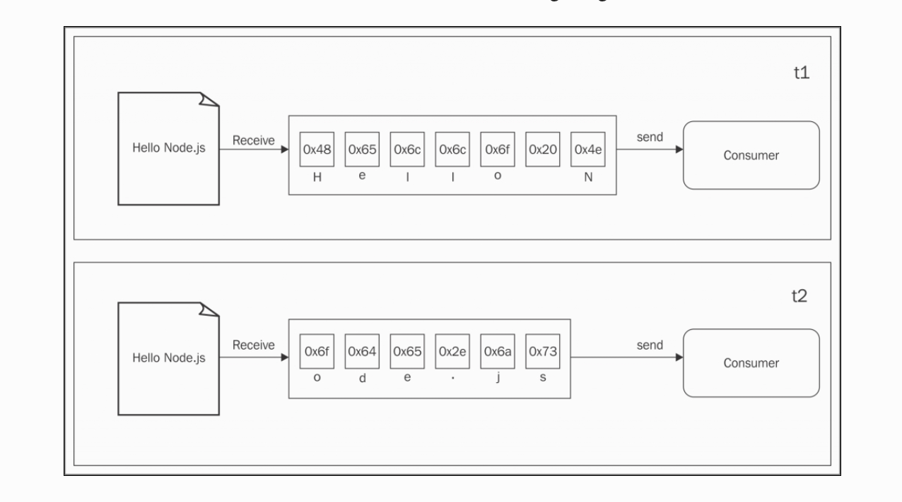

# Coding with Streams

流是 Node.js 中最重要的组件和模式。在社区中有一句格言： “流是一切！”，这就是流。有很多原因让流充满吸引力；这不仅是关于技术上的性能和效率，这更多的关乎到优雅和适配到 Node.js 哲学。

在本章，你将学到下面的主题：

* 为什么流在 Node.js 中如此重要
* 创建并使用流
* 流作为编程范例：不只在 I/O 中大放异彩
* 管道模式和连接流在不同的配置

## 走进流

在 Node.js 这类基于事件的平台中，流是最完美实时处理 I/O 操作的选择。

### buffering 对流

在本书内我们提到的额大部分异步 API 都使用了 buffer 模式。对于一个输入操作，buffer 模式中所有的数据都被转换为 buffer；当整个资源被读取时 buffer 被传入回掉。下面的图展示了这个过程：


在 t1 内，一些数据被资源所接收然后存入了 buffer。在 t2 内，另一些数据块被接收，直到读操作完成后所有的 buffer 被发送给了消费者。

从另一方面说，流允许我们在数据到达资源时立即对其进行操作。



每当有新的数据块被资源接收时，它就会立即提供给消费者，消费者也可以直接对其进行操作。

但是这两种实现有什么区别呢？主要有两个方面：

* 空间效率
* 时间效率

但是，Node.js 流有另一个最重要的优势：组合性。 我们来看看这到底是什么意思。

### 空间效率

首先，流允许我们做那些不可能的事情，一次处理 buffer 数据。例如当我们在读取一个特别大的文件时，成百上千兆的文件。当文件被完全被读取后返回一个 buffer 可不是个好主意，可以想象一下那些同时读取几个大文件的情况。我们的应用可以轻易被耗尽内存。而且在 V8 内 buffer 的大小被限制到 1GB 以内。

#### 使用 buffer API 来进行压缩

一个具体的例子，我们用命令行来压缩文件。使用 buffer API 来对文件进行 gzip：

````JavaScript
const fs = require('fs');
const zlib = require('zlib');

const file = process.argv[2];

fs.readFile(file, (err, buffer) => {
  zlib.gzip(buffer, (err, buffer) => {
    fs.writeFile(file + '.gz', buffer, err => {
      console.log('File successfully compressed');
    });
  });
});

````
现在我们可以这样来压缩文件

**node gzip <path to file>**

如果我们选择了一个大于 1GB 的文件，我们将接收到像下面这样的错误提示：

**RangeError: File size is greater than possible Buffer: 0x3FFFFFFF bytes**

这时就该让流出场了。

#### 使用流来进行压缩

````JavaScript
const fs = require('fs');
const zlib = require('zlib');
const file = process.argv[2];

fs.createReadStream(file)
  .pipe(zlib.createGzip())
  .pipe(fs.createWriteStream(file + '.gz'))
  .on('finish', () => console.log('File successfully compressed'));

````
很简单，对吧？

### 时间效率

假如现在有一个压缩好的文件需要上传到远程 HTTP 服务，然后对其进行解压缩保存，如果我们使用了 buffer API 的话，上传会等到文件被读取压缩完成后才开始，换句话说解压缩也需要所有数据被收到到时才开始。当使用流时就允许我们一边压缩一边上传文件，在服务器端也可以一边接收文件一边解压缩。我们这就来示范一下：

````JavaScript
// gzipReceive.js
const http = require('http');
const fs = require('fs');
const zlib = require('zlib');

const server = http.createServer((req, res) => {
  const filename = req.headers.filename;
  console.log('File request received: ' + filename);
  req.pipe(zlib.createGunzip())
      .pipe(fs.createWriteStream(filename))
      .on('finish', () => {
         res.writeHead(201, {'Content-Type': 'text/plain'});
         res.end('That's it）
         console.log(`File saved: ${filename}`);
      });
  });
  server.listen(3000, () => console.log('Listening'));


 // gzipSend.js
  const fs = require('fs');
  const zlib = require('zlib');
  const http = require('http');
  const path = require('path');
  const file = process.argv[2];
  const server = process.argv[3];

  const options = {
    hostname: server,
    port: 3000,
    path: '/',
    method: 'PUT',
    headers: {
      filename: path.basename(file),
      'Content-Type': 'application/octet-stream',
      'Content-Encoding': 'gzip'
    }
  };

  const req = http.request(options, res => {
    console.log('Server response: ' + res.statusCode);
  });

  fs.createReadStream(file)
    .pipe(zlib.createGzip())
    .pipe(req)
    .on('finish', () => {
      console.log('File successfully sent');
  });

````

我们来使用流处理这些文件 **node gzipReceive    node gzipSend <path to file> localhost**，下面的图例将解释一切：


1. 客户端读取文件
1. 客户端压缩数据
1. 客户端发送数据给服务端

1. 服务端接收数据
1. 服务端解压缩
1. 服务端写入数据

正如图示中看到的，使用 buffer 时所有的处理都是序列化的，使用了流以后我们可以实时接收数据块并对之操作，也不需要等待读取完所有数据，所有的操作都是平行执行的。因为所有的操作都是异步的。唯一的限制就是数据块的顺序必须保持一致。

### 组合性

我们来看另一个使用流的事例：

````JavaScript

const crypto = require('crypto');
// ...
fs.createReadStream(file)
  .pipe(zlib.createGzip())
  .pipe(crypto.createCipher('aes192', 'a_shared_secret'))
  .pipe(req)
  .on('finish', () => console.log('File succesfully sent'));

//server.js
const crypto = require('crypto');
// ...
const server = http.createServer((req, res) => {
  // ...
  req
    .pipe(crypto.createDecipher('aes192', 'a_shared_secret'))
    .pipe(zlib.createGunzip())
    .pipe(fs.createWriteStream(filename))
    .on('finish', () => { /* ... */ });
});

````
简简单单，我们为我们的应用加了一层加密层。

我们可以很轻松地处理我们的流，可以更好地实现模块化。


## 以流开始

在前面的章节里我们领略到了流的厉害，现在我们来看看细节。

### 流的解剖

每一个在 Node.js 中的流都由下面的四个抽象类实现

* stream.Readable
* stream.Writeable
* stream.Duplex
* stream.Transform

每一个流类也是 EventEmitter 的实例。流实际上也有一些事件： end、error。

另一个使流如此灵活的原因是流不仅可以处理二进制数据，也可以是任意 JavaScript 值，实际上它支持下面两种类型：

* Binary mode： 这个模式的数据可以是块就像是 buffer 或 字符串
* Object mode： 这个模式的流数据是分离的序列化对象

这两种操作模式允许我们不只在 I/O 操作中使用流，也可以在其它一些工具或功能上优雅的使用流。

### 可读流

可读流用于呈现数据；在 Node.js 中它用 stream 模块的 Readable 抽象类实现。

#### 在流中读取数据

这里有两种方法来接收
